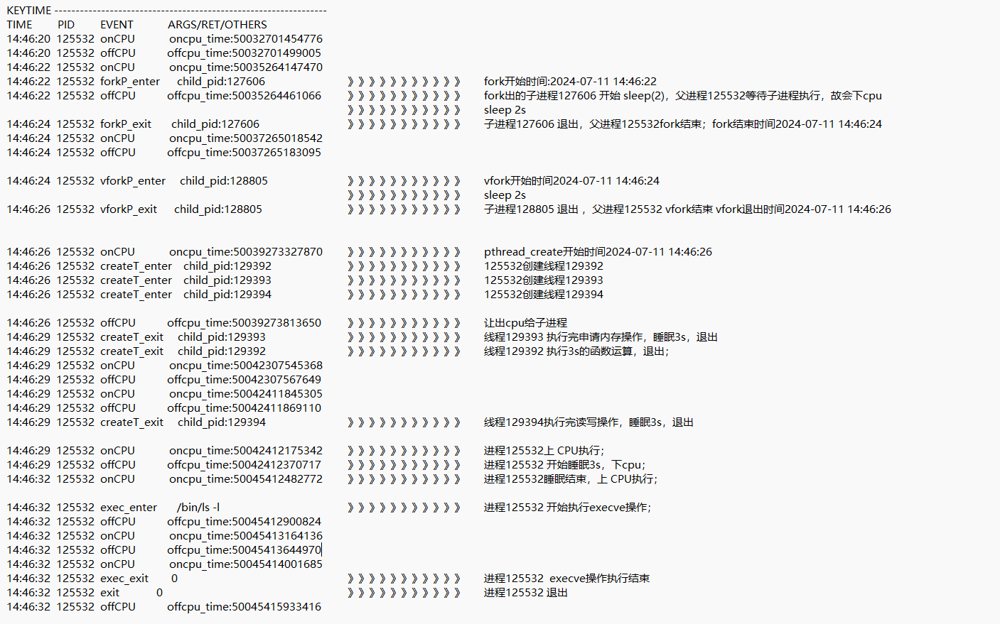

# 数据真实性测试

本次测试工作主要包括：

* 针对进程画像的每个功能，涉及测试用例，在逻辑上验证ebpf程序的正确性；
* 学习使用LTTng工具，通过该工具实现相同或相似功能，将测试用例在使用在LTTng工具上，验证进程画像相应工具数据的正确性；
* 学习使用trace compass可视化性能分析工具，将LTTng监测出的数据放在trace compass上查看进程流程，并根据LTTng工具提供的技术文档来梳理不同数据见的关系;
* 输出数据关联性文档;

## 0.准备工作：

学习使用LTTng 来监测数据;

学习将LTTng生成的文件在compass上跑出来,并分析;

### 0.1.LTTng学习使用:

[linux下 LTTng使用详细说明_no package 'liburcu' found-CSDN博客](https://blog.csdn.net/mao_hui_fei/article/details/120654095)

```c
lttng create my-session
lttng enable-event --kernel sched_switch
lttng add-context --kernel --type pid --type tid
lttng track --kernel --pid <pid>
lttng track --kernel --tid <tid>
lttng start
# 运行你想监控的进程或线程
lttng stop
lttng view
lttng destroy
```

### 0.2.trace compass

[Trace Compass User Guide - LTTng Kernel Analysis (eclipse.org)](https://archive.eclipse.org/tracecompass/doc/stable/org.eclipse.tracecompass.doc.user/LTTng-Kernel-Analysis.html#Control_Flow_View)


## 1.keytime_image

keytime_image 是一个用于捕获进程关键时间点的工具，聚焦于进程何时创建（fork，vfork, pthread_create）,何时上CPU，何时下CPU，何时执行execve等。通过ebpf技术将其挂载固定的挂载点上，并在进程发生以上几种行为时进行数据收集，并对数据进行处理，可以通过数据描绘出进程在关键时间点上的行为；

本次测试以及数据关联工作分为三部分：

* keytime_image工具逻辑正确性的测试；
* keytime_image工具数据正确性的测试；
* keytime_image工具数据的关联关系，以及原理梳理；

### 1.1 测试用例 test_keytime

为了完成以上三步测试与数据关联工作，需要涉及一个测试用例，使用该测试用例可以测试keytime_image工具的逻辑正确性，并通过和lttng工具测试的结果进行对比，判断keytime_image数据正确性；

#### 1.1.1 测试用例设计思路

测试用例主要目的是为了模拟一个进程的一组行为，包括keytime_image所检测的关键时间点，从而查看keytime_image在进程行为观测上是否正确无误；

测试用例主要思路

* 对测试用例进程进行cpu绑核,提高优先级,保证当前cpu仅运行一个或一组进程;
* 分别通过fork,vfork创建新进程;
* 通过pthread_create创建3个不同的线程,并将三个线程绑核,保证整个线程组在同一个cpu上运行;
	* 线程1:执行cpu密集型任务;
	* 线程2:执行mem密集型任务;
	* 线程3:执行io密集型任务;
	* 注意:这三个线程会存在抢占cpu现象,这是由于三者的优先级一致;
* 通过sleep(3),让当前进程从绑定的cpu上下来,当睡眠结束,进程则会上cpu;
* 通过execve();,让测试程序执行指定的操作,方便测试keytime_image能否监测到进程执行execve;
* 如果execve()执行失败,则执行exit来终止进程;

### 1.1.2 测试脚本:

在通过测试用例对keytime_image工具进行逻辑正确性的验证之后,需要验证keytime_image工具采集到的数据是否是可靠的;

这里通过一个测试脚本实现keytime_image工具和lttng同时监测测试用例的数据，并将数据导出；

### 1.2 结果分析：

通过测试用例和测试脚本，对keytime_image工具的逻辑正确性和数据正确性进行了评估，本小节将针对输出的数据进行正确性检测；

#### 1.2.1.逻辑正确性：

通过脚本，可以获取到keytime_image监测测试用例进程的全过程；以下是输出的数据：

```shell
KEYTIME -------------------------------------------------------------------------------------------------
TIME      PID     EVENT            ARGS/RET/OTHERS
14:46:20  125532  onCPU            oncpu_time:50032701454776 
14:46:20  125532  offCPU           offcpu_time:50032701499005
14:46:22  125532  onCPU            oncpu_time:50035264147470 
14:46:22  125532  forkP_enter      child_pid:127606 
14:46:22  125532  offCPU           offcpu_time:50035264461066
14:46:24  125532  forkP_exit       child_pid:127606 
14:46:24  125532  onCPU            oncpu_time:50037265018542 
14:46:24  125532  offCPU           offcpu_time:50037265183095
14:46:24  125532  vforkP_enter     child_pid:128805 
14:46:26  125532  vforkP_exit      child_pid:128805 
14:46:26  125532  onCPU            oncpu_time:50039273327870 
14:46:26  125532  createT_enter    child_pid:129392 
14:46:26  125532  createT_enter    child_pid:129393 
14:46:26  125532  createT_enter    child_pid:129394 
14:46:26  125532  offCPU           offcpu_time:50039273813650
14:46:29  125532  createT_exit     child_pid:129393 
14:46:29  125532  createT_exit     child_pid:129392 
14:46:29  125532  onCPU            oncpu_time:50042307545368 
14:46:29  125532  offCPU           offcpu_time:50042307567649
14:46:29  125532  onCPU            oncpu_time:50042411845305 
14:46:29  125532  offCPU           offcpu_time:50042411869110
14:46:29  125532  createT_exit     child_pid:129394 
14:46:29  125532  onCPU            oncpu_time:50042412175342 
14:46:29  125532  offCPU           offcpu_time:50042412370717
14:46:32  125532  onCPU            oncpu_time:50045412482772 
14:46:32  125532  exec_enter       /bin/ls -l 
14:46:32  125532  offCPU           offcpu_time:50045412900824
14:46:32  125532  onCPU            oncpu_time:50045413164136 
14:46:32  125532  offCPU           offcpu_time:50045413644970
14:46:32  125532  onCPU            oncpu_time:50045414001685 
14:46:32  125532  exec_exit        0 
14:46:32  125532  exit             0 
14:46:32  125532  offCPU           offcpu_time:50045415933416

```

结合测试用例在执行特定操作时的时间节点输出，可以验证在特定时间点，keytime_image是否正确捕获测试进程的该行为：

```shell
#PID125532绑定CPU4：√
#PID125532 被绑定在以下cpu上: 4 
test_proc进程的TGID:125532       PID:125532      CPU_id:4
输入任意数字继续程序的运行:
程序开始执行...

KEYTIME_TEST-----------------------------------------------

fork逻辑------------------------:
fork开始时间2024-07-11 14:46:22
(fork)子进程pid:127606,睡眠2s后退出
fork结束时间2024-07-11 14:46:24
(fork)pid为127606的子进程退出

输入任意数字开始测试vfork:vfork逻辑------------------------:
vfork开始时间2024-07-11 14:46:24
(vfork)子进程pid:128805,睡眠2s后退出
vfork退出时间2024-07-11 14:46:26
(vfork)pid为128805的子进程退出

输入任意数字开始测试 pthread_create:pthread_create逻辑------------------------:
pthread_create开始时间2024-07-11 14:46:26

  #3.PID:129394 TGID:125532
    #PID129394绑定CPU4：√
    #PID129394 被绑定在以下cpu上: 4 
  #IO密集型

  #2.PID:129393 TGID:125532
    #PID129393绑定CPU4：√
    #PID129393 被绑定在以下cpu上: 4 
  #MEM 密集型

  #1.PID:129392 TGID:125532
    #PID129392绑定CPU4：√
    #PID129392 被绑定在以下cpu上: 4 
  #CPU密集型
    #129393退出
    #129392退出
    #129394退出
pthread_create结束时间2024-07-11 14:46:29

输入任意数字开始测试 上下cpu:进程上下CPU逻辑------------------------:
CPU sleep 开始时间2024-07-11 14:46:29
CPU sleep 结束时间2024-07-11 14:46:32
程序睡眠3s!

输入任意数字开始测试 execve:execve开始时间2024-07-11 14:46:32
execve逻辑------------------------:
total 60
-rw-rw-r--  1 xhb  xhb    194 Jul  9 10:51 Makefile
drwxrwxr-x  5 xhb  xhb   4096 Jul 11 14:46 ebpf
-rwxr-xr-x  1 xhb  xhb    995 Jul 10 23:10 ebpf_test.sh
drwxrwx--- 18 xhb  xhb   4096 Jul 11 14:46 lttng-traces
-rwxr-xr-x  1 xhb  xhb   1913 Jul 10 23:02 test_keytime.sh
-rwxr-xr-x  1 root root 26256 Jul 11 04:43 test_proc_image
-rw-rw-r--  1 xhb  xhb   9493 Jul 11 04:45 test_proc_image.c
```



通过对比测试用例关键点的时间和行为，与keytime_image关键点的时间完全一致，且keytime_image可以观测到进程执行cpu、mem、io等行为；至此我们可以得出结论，keytime_image逻辑正确，功能可用；

#### 1.2.2 数据正确性

通过将keytime_image获取的数据同lttng作对比，便可得到  进程的整体行为是否正确，数据获取是否正确，描述该行为需要哪些数据进行关联；

这里通过多次测试（包括但不限于指定某一进程进行数据采集，指定某一个线程组进行数据采集，不指定固定进程或线程采集全部数据信息），均证明可以证明keytime_image获取到的数据是真实可靠且可以描绘进程关键时间点行为的。原始数据在这里：

keytime_image测出的数据：[keytime_image测试数据详细](../data/output.log)

lttng 测出的数据：
- [lttng 测试数据表](../data/keytime_test_data.csv)
- [lttng 测试数据详细](../data/trace_data.txt)

### 1.3.关键数据点的关联关系

通过lttng检测到的数据以及在trace compass上可以看到进程的行为跟踪图，我们这里可以根据lttng所提供的关键数据点指导进程行为分析，从而将这些数据关联到一起。本小节将找到这些关键数据点，并依据内核中的香相关原理来指导进程行为分析。

keytime_image关注点在一个进程或线程，我们以125532进程为例，分析keytime_image观测到该进程的具体行为，该进程的行为众多，这里值分析典型行为：创建进程，上下cpu，执行execve，以及进程退出：

#### 1.3.1 创建进程：

由于lttng关于进程创建的跟踪点为 sched_process_fork 只能识别进程创建了子进程，不能识别到通过什么方式创建的，而keytime_image可以通过uprobe和uretpobe识别到时是fork、vfork还是pythreat_create创建的子进程或线程；

##### 1.3.1.1 fork

**【22:811111842】**

- 行为：主体进程125532，fork出子进程127606 

- 数据点：父进程的信息，子进程的信息；

	* parent_comm = "test_proc_image", parent_tid = 125532, parent_pid = 125532； 

	* child_comm = "test_proc_image", child_tid = 127606，child_pid = 127606；
	* cpu_id = 4；

- 原理：lttng的挂载点在sched_process_fork上，记录了父进程的信息，子进程的信息，以及在哪个cpu上进行的fork；而我们的keytime_image则将挂载点放在了用户态fork上，可以看到父进程fork开始和fork结束的时间；这一点相较于lttng关注到了用户态，更细节；


##### 1.3.1.2 vfork

**【24:811853001】**

- 行为：主体进程125532 vfork 出子进程128805；

- 数据点：父进程的信息，子进程的信息；

	-  prev_comm = "test_proc_image", prev_tid = 125532，prev_prio = 20, prev_state = 1； 

	- next_comm = "test_proc_image", next_tid = 127606, next_prio = 20；

- 原理：lttng的挂载点在sched_process_fork上，记录了父进程的信息，子进程的信息，以及在哪个cpu上进行的fork；而我们的keytime_image则将挂载点放在了用户态vfork上，可以看到父进程vfork开始和fork结束的时间；并且可以知道父进程是如何创建了子进程,这一点相较于lttng关注到了用户态，更细节；


##### 1.3.1.3 pthread_create

**【26:820321972】**

- 行为：主体进程125532创建线程129392，
- 数据点：父进程的信息，子进程的信息；
	* parent_comm = "test_proc_image", parent_tid = 125532, parent_pid = 125532；
	* child_comm = "test_proc_image", child_tid = 129392，child_pid = 125532
- 原理：lttng的挂载点在sched_process_fork上，记录了父进程的信息，子进程的信息，以及在哪个cpu上进行的fork；而我们的keytime_image则将挂载点放在了用户态上pthread_create，可以看到父进程pthread_create开始和fork结束的时间；并且可以知道父进程是如何创建了子进程,这一点相较于lttng关注到了用户态，更细节；


#### 1.3.2 上下CPU：

上下CPU是CPU调度时产生的进程行为，由于不同的调度策略会使不同的进程上下CPU，一般进程上下CPU是在linux内核函数中的`__schedule()`中实现的，具体是通过`__schedule()–>pick_next_task()`选择下一个要上CPU的进程，`__schedule()–>context_switch()`进行上下文切换，完成进程上下CPU操作；

keytime_image和lttng都关注到`__schedule()`中的一个静态挂载点：`sched_switch`，此时cpu知道了哪个进程下cpu，哪个进程上cpu，故而该关键点处的数据便可以描绘出进程上下cpu的行为；


测试用例中涉及到了很多上下CPU的情况，此处将分析主体进程创建的三个线程129392,129393,129394三者之间在CPU4上的切换情况。


**【26:820503574】**

- 行为：主体进程125532让出cpu，子进程 129394上CPU；
- 数据点：上CPU进程信息，下CPU进程信息；
	- prev_comm = "test_proc_image", prev_tid = 125532, prev_prio = 20, prev_state = 1,；
	- next_comm = "test_proc_image", next_tid = 129394, next_prio = 20； 
- 原理：挂载点在sched_switch上，记录了进程在cpu上切换的数据，哪个进程下cpu，哪个进程上cpu；

**【26:823397729】**

- 行为：线程129394让出cpu，子进程 129393上CPU；
- 数据点：上CPU进程信息，下CPU进程信息；
	- prev_comm = "test_proc_image", prev_tid = 129394, prev_prio = 20, prev_state = 2;
	- next_comm = "test_proc_image", next_tid = 129393, next_prio = 20；
- 原理：挂载点在sched_switch上，记录了进程在cpu上切换的数据，哪个进程下cpu，哪个进程上cpu；

**【26:826032494】**

- 行为：线程129393让出cpu，子进程  129394上CPU；
- 数据点：上CPU进程信息，下CPU进程信息；
	- prev_comm = "test_proc_image", prev_tid = 129393, prev_prio = 20, prev_state = 1；
	- next_comm = "test_proc_image", next_tid = 129394, next_prio = 20 ;
- 原理：挂载点在sched_switch上，记录了进程在cpu上切换的数据，哪个进程下cpu，哪个进程上cpu；

**【26:826933280】**

- 行为：线程129394让出cpu，线程 111470上CPU；
- 数据点：上CPU进程信息，下CPU进程信息；
	- prev_comm = "test_proc_image", prev_tid = 129394, prev_prio = 20, prev_state = 256；
	- next_comm = "kworker/4:1", next_tid = 111470, next_prio = 20；
- 原理：挂载点在sched_switch上，记录了进程在cpu上切换的数据，哪个进程下cpu，哪个进程上cpu；

**【26:835640901】**

- 行为：线程129394让出cpu，线程129392上CPU；
- 数据点：上CPU进程信息，下CPU进程信息；
	- prev_comm = "test_proc_image", prev_tid = 129394, prev_prio = 20, prev_state = 2；
	- next_comm = "test_proc_image", next_tid = 129392, next_prio = 20
- 原理：挂载点在sched_switch上，记录了进程在cpu上切换的数据，哪个进程下cpu，哪个进程上cpu；

通过以上数据就可将keytime_image工具所监测到的数据所描述的进程行为描述出来，做到上下CPU这个行为的数据关联；


#### 1.3.3 execve执行：

execve是进程所执行的一个程序，它是进程的一种行为，会替换当前进程的地址空间，并加载并执行一个新的程序，这里`execve` 不创建新进程，而是替换当前进程。

keytime_image工具通过挂载点sys_enter_execve、sys_exit_execve对进程execve行为进行监测，而lttng通过sched_process_exec实现相同的数据监测。

**【32:960747436】**

- 行为：线程 125532,执性程序/bin/ls;
- 数据点：哪个进程/线程在执行，执行的命令，下CPU进程信息；
	- filename = "/bin/ls", tid = 125532, old_tid = 125532；

* 原理：挂载点在sched_process_exec，或sys_enter_execve、sys_exit_execve上，用户态进程执行execve时会通过系统调用在内核中进行相关操作，通过sys_enter_execve、sys_exit_execve便可以获取到用户态进程执行的execve信息；

#### 1.3.4 exit 执行：

exit可以用于终止进程, 会导致当前进程的执行终止，并返回一个退出状态码给操作系统；同execve一样，exit会通过系统调用到内核中实现终止进程的操作；所以我们在sys_enter_exit、sys_enter_exit_group两处进行插装，获取到关于进程退出时的相关数据，这里主要是进程退出时间的统计；

**【32:962637158】**

- 行为：进程 125532, 退出;
- 数据点：哪个进程/线程，在什么时间点退出；
	- pid : 125532    exit             ret :0；

- 原理：挂载点在sys_enter_exit、sys_enter_exit_group上，用户态进程执行exit时会通过系统调用在内核中进行相关操作，通过sys_enter_exit、sys_enter_exit_group便可以获取到用户态进程终止时的信息；

